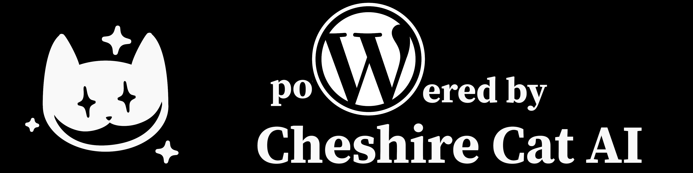

# Cheshire Cat WP Plugin

**Cheshire Cat WP** is a WordPress plugin that integrates the [Cheshire Cat AI](https://cheshire-cat.ai/) chatbot into your WordPress website. It allows you to add a conversational AI assistant to your site, providing an interactive and engaging experience for your users.

## Features

*   **Seamless Integration:** Easily integrate the Cheshire Cat AI chatbot into your WordPress site.
*   **Conversational AI:** Engage users with a natural language processing-powered chatbot.
*   **Customizable Chat Interface:** Style the chat interface to match your website's design.
*   **Sequential Conversation Display:** Show user and bot messages in a clear, chronological order.
*   **Loading Indicator:** Display a loading animation while waiting for the bot's response.
*   **Error Handling:** Display error messages if there are issues with the connection or the bot's response.
* **Easy to use:** Use a shortcode to add the chat to your pages.

## Installation

1.  **Download:** Download the latest release of the Cheshire Cat WP plugin from the [Releases](https://github.com/your-username/cheshire-cat-wp/releases) page (replace `your-username` with your GitHub username if you plan to host it there).
2.  **Upload:** Upload the `cheshire-cat-wp` folder to the `/wp-content/plugins/` directory of your WordPress installation.
3.  **Activate:** Activate the plugin through the 'Plugins' menu in WordPress.

## Configuration

1.  **Cheshire Cat URL and Token:** Go to the WordPress admin panel, then navigate to **Settings -> Cheshire Cat**.
2.  **Enter your Cheshire Cat URL** (e.g., `http://localhost:1865`) and **your API token**.
3.  **Save Changes.**

## Usage

1.  **Add the Shortcode:** To add the chat interface to a page or post, use the `[cheshire_chat]` shortcode.

2.  **Interact with the Chatbot:** Visit the page where you added the shortcode and start chatting with the Cheshire Cat AI.

## Dependencies

*   **Cheshire Cat AI:** You need a running instance of the Cheshire Cat AI server.
*   **Cheshire Cat SDK for Laravel:** The plugin uses the `webgrafia/cheshire-cat-sdk-laravel` package for interacting with the Cheshire Cat API.
* **Guzzle:** The plugin uses the `guzzlehttp/guzzle` package for making HTTP requests.
* **Phrity/net-uri:** The plugin uses the `phrity/net-uri` package for handling URIs.

## Contributing

If you'd like to contribute to the development of this plugin, please feel free to:

*   Fork the repository.
*   Create a new branch for your changes.
*   Submit a pull request.

## License

This plugin is licensed under the GPL3 license.

## Support

If you encounter any issues or have questions, please open an issue on the GitHub repository.

## Credits

*   Marco Buttarini - Author
*   Cheshire Cat AI - The AI chatbot platform.
* webgrafia/cheshire-cat-sdk-laravel - The SDK used to interact with the Cheshire Cat API.
* guzzlehttp/guzzle - The HTTP client used to make requests.
* phrity/net-uri - The package used to handle URIs.