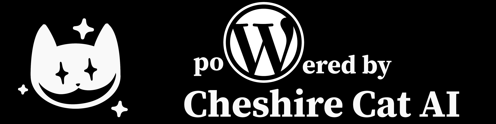

# Cheshire Cat Chatbot for WordPress



**Cheshire Cat Chatbot** is a WordPress plugin that seamlessly integrates the [Cheshire Cat AI](https://cheshirecat.ai/) chatbot into your WordPress website. It allows you to add a conversational AI assistant to your site, providing an interactive and engaging experience for your users.

## Features

* **Seamless Integration:** Easily integrate the Cheshire Cat AI chatbot into your WordPress site.
* **Conversational AI:** Engage users with a natural language processing-powered chatbot.
* **Customizable Chat Interface:** Style the chat interface to match your website's design:
  * Customize colors for chat background, text, user messages, and bot messages
  * Choose your preferred font family
  * Set a personalized welcome message
* **Global Chat Option:** Enable the chat on every page of your website or choose a specific post type or taxonomy.
* **Responsive Design:** The chat interface adapts to different screen sizes, including mobile devices.
* **User Experience Enhancements:**
  * Sequential conversation display shows messages in a clear, chronological order
  * Loading indicator while waiting for the bot's response
  * Smooth animations for message transitions
  * Clear visual distinction between user and bot messages
  * Predefined questions/responses that can be displayed in content
  * Chat persistence across page navigation
* **Security Features:**
  * XSS protection for message content
  * AJAX nonce verification for all requests
  * Proper data sanitization and validation
* **Error Handling:** Informative error messages if there are issues with the connection or the bot's response.
* **Accessibility:** Improved keyboard navigation and focus states for better accessibility.
* **Easy to Use:** Simple shortcode `[cheshire_chat]` to add the chat to specific pages.
* **Avatar Support:** Display a customizable avatar below the chat, making it look like a speech bubble.
* **Context Awareness:** Optionally send page context information (title, content, etc.) to make the chatbot aware of the current page's content.
* **TinyMCE Editor Integration:** Add AI-generated content directly to your posts and pages with a dedicated TinyMCE editor button.
* **WebSocket Communication:** Enjoy improved real-time chat experience with faster message delivery (with automatic fallback to AJAX when WebSocket is not available).
* **Declarative Memory Integration:** Automatically upload your WordPress content to Cheshire Cat's declarative memory, with support for WooCommerce products and batch processing.

## Installation

1. **Download:** Download the latest release of the Cheshire Cat Chatbot plugin from the [Releases](https://github.com/webgrafia/cheshire-cat-chatbot/releases) page.
2. **Upload:** Upload the `cheshire-cat-chatbot` folder to the `/wp-content/plugins/` directory of your WordPress installation.
3. **Activate:** Activate the plugin through the 'Plugins' menu in WordPress.
4. **Configure:** Go to the WordPress admin panel, then navigate to **Settings -> Cheshire Cat**.
5. **Enter API Details:** Enter your Cheshire Cat URL (e.g., `http://localhost:1865`) and your API token.
6. **Save Changes.**

## Configuration

1. **Access Settings:** Go to the WordPress admin panel, then navigate to **Settings -> Cheshire Cat**.
2. **Basic Setup:**
   * Enter your Cheshire Cat URL (e.g., `http://localhost:1865`)
   * Enter your API token
   * Optionally enable Global Chat to show the chat on all pages
   * Select specific post types or taxonomies where the chat should appear
3. **Customize Appearance:** Go to the **Style** section to customize colors, fonts, welcome message, and avatar settings.
4. **Configure Predefined Questions:**
   * Enter predefined questions/responses in the Predefined Responses field
   * Set a title for the predefined responses section
   * Enable "Show predefined responses in content" to display them on posts/pages
   * Select which post types should have predefined responses
   * Optionally hide predefined questions in chat when they are shown in content
5. **Context Awareness:** Optionally enable the Context Awareness feature to make the chatbot aware of the current page's content.
6. **Save Changes.**

## Usage

### Using the Shortcode

To add the chat interface to a specific page or post, use the `[cheshire_chat]` shortcode:

```
[cheshire_chat]
```

### Using Global Chat

If you want the chat to appear on every page of your website:

1. Go to **Settings -> Cheshire Cat**
2. Check the "Enable Global Chat" option
3. Optionally select specific post types or taxonomies where the chat should appear
4. Save Changes

### Using Predefined Questions/Responses

Predefined questions/responses allow you to suggest common questions that users might want to ask the chatbot:

1. **Global Configuration:**
   * Set up global predefined questions in **Settings -> Cheshire Cat**
   * These will appear on all enabled post types when "Show predefined responses in content" is enabled

2. **Per-Post Configuration:**
   * Each enabled post type (posts, pages, products, etc.) will have a "Cheshire Cat Predefined Questions" meta box
   * Enter post-specific questions to override the global questions for that specific post
   * Leave empty to use the global questions

3. **Display:**
   * Questions appear at the end of content or after WooCommerce product information
   * Users can click on these questions to automatically send them to the chatbot
   * Optionally hide predefined questions in chat when they are shown in content

### Using the TinyMCE Editor Button

To add AI-generated content directly to your posts and pages:

1. When editing a post or page, you'll see a Cheshire Cat button in the editor toolbar
2. Click it to open a dialog where you can enter a prompt
3. After submitting, the AI-generated response will be inserted directly into your content at the cursor position

### Chat Persistence

The chat conversation persists across page navigation, allowing users to maintain their conversation when navigating between pages:

1. Users can continue their conversation as they browse different pages on your site
2. A "New conversation" button is available to clear the chat history and start fresh

### Using the Avatar Feature

To enable and customize the avatar feature:

1. Go to **Settings -> Cheshire Cat** and navigate to the **Style** section
2. Enable the avatar feature
3. Upload a custom avatar image
4. The chat will now appear as a speech bubble above the avatar

### Using the Playground

The Playground is a full-page chat interface for administrators to test the chatbot:

1. Access it from the Cheshire Cat menu in the WordPress admin area
2. Use it to test the chatbot's responses in a dedicated environment

### Using Declarative Memory

To upload your WordPress content to Cheshire Cat's declarative memory:

1. Content is automatically uploaded to declarative memory when posts are saved
2. Use the Declarative Memory Sync admin page for batch processing posts
3. Filter by post types, status, and date range
4. Monitor progress with the built-in progress bar

## Frequently Asked Questions

### What is Cheshire Cat AI?
Cheshire Cat AI is an open-source AI chatbot platform. You need to have a running instance of Cheshire Cat AI to use this plugin.

### Where can I find my Cheshire Cat URL and Token?
You can find these details in your Cheshire Cat AI instance's configuration.

### How do I customize the chat interface?
You can customize the chat interface's colors and font in the **Settings -> Cheshire Cat** section of your WordPress admin panel.

### Can I use the chat on every page?
Yes, you can enable the "Global Chat" option in the **Settings -> Cheshire Cat** section.

### How do I enable the avatar feature?
You can enable the avatar feature in the **Style** section of the Cheshire Cat menu. After enabling it, you can upload a custom avatar image in the same section.

### What is the Playground page?
The Playground page is a full-page chat interface for administrators to test the chatbot. It's accessible from the Cheshire Cat menu in the WordPress admin area.

### What is the Context Awareness feature?
The Context Awareness feature allows the chatbot to receive information about the current page (such as title, content, categories, etc.) with each message. This helps the chatbot provide more relevant responses based on the page the user is viewing. You can enable this feature in the Configuration section.

### How do I use the TinyMCE editor button?
When editing a post or page, you'll see a Cheshire Cat button in the editor toolbar. Click it to open a dialog where you can enter your prompt. After submitting, the AI-generated response will be inserted directly into your content at the cursor position.

## Dependencies

* **Cheshire Cat AI:** You need a running instance of the Cheshire Cat AI server.
* **Cheshire Cat SDK for Laravel:** The plugin uses the `webgrafia/cheshire-cat-sdk-laravel` package.
* **Guzzle:** For making HTTP requests to the Cheshire Cat API.
* **Font Awesome:** For the chat interface icons.

## For Developers

### CSS Variables

The chat interface uses CSS variables for easy theming. You can override these variables in your theme's CSS:

```css
:root {
    --chat-primary-color: #0078d7;
    --chat-user-msg-bg: #4caf50;
    --chat-bot-msg-bg: #ffffff;
    /* See chat.css for all available variables */
}
```

### Hooks and Filters

The plugin provides hooks for developers to extend its functionality (coming in future versions).

## Current Version

The current stable version is 1.0.4, which includes:

* Fix: Prevented WordPress admin post/product saving freeze when Cheshire Cat server is offline or slow by implementing HTTP client connection timeouts and asynchronous WP-Cron processing for declarative memory operations
* Optimization: Conditional enqueuing of frontend JavaScript and CSS assets (only on pages where chatbot or interactive predefined responses are enabled/displayed)
* Performance: Improved page load speeds and Core Web Vitals for pages where the chatbot is inactive or restricted
* New: Option to show a guest preview of the chatbot when access is restricted to logged-in users
* All the features from previous versions including built-in themes, declarative memory sync and WooCommerce integration

For a complete history of changes, please see the [Changelog](https://wordpress.org/plugins/cheshire-cat-chatbot/#developers) on the WordPress plugin page.

## Contributing

If you'd like to contribute to the development of this plugin, please:

1. Fork the repository
2. Create a new branch for your changes
3. Follow WordPress coding standards
4. Submit a pull request

## License

This plugin is open-source software licensed under the [GNU General Public License v3.0 or later](LICENSE).

## Support

If you encounter any issues or have questions, please open an issue on the GitHub repository.

## Credits

* **Marco Buttarini** - Plugin Author
* **Cheshire Cat AI** - The AI chatbot platform
* **Contributors** - Thanks to all who have contributed to this project
